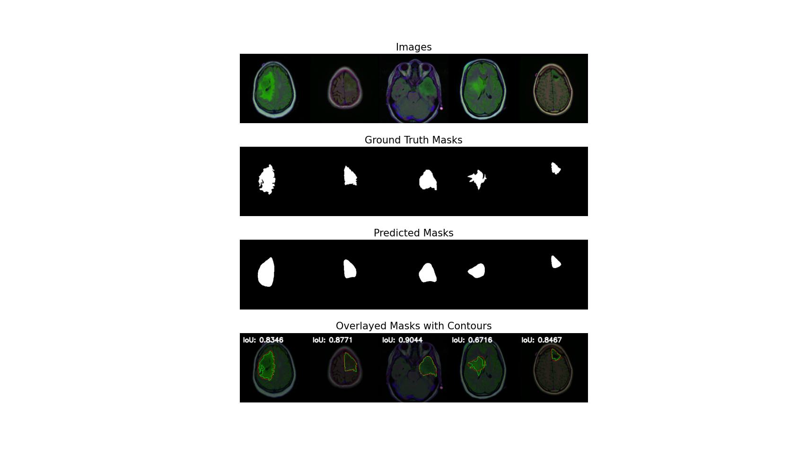

# MRI Segmentation using MedViT

This project focuses on fine-tuning the MedViT (Medical Vision Transformer) model for MRI segmentation tasks. The goal is to accurately segment regions of interest in MRI scans using a pre-trained MedViT model, followed by evaluating the performance using various metrics such as Intersection over Union (IoU).

## Getting Started

### Installation

1. Clone the repository:
   ```sh
   git clone https://github.com/dheerajpr97/MRI-Seg-MedViT.git
   cd MRI-Seg-MedViT
2. Install the required packages:
   ```sh
   pip install -r requirements.txt

### Dataset Preparation
Ensure your dataset is organized as follows:
```
data/
   lgg-mri-segmentation/
      TCGA_CS_4941_19960909/
      image1.tif
      image1_mask.tif
      ...
      
   splits/
      train_indices.txt
      val_indices.txt
      test_indices.txt
```

### Training the Model
To train the model, run the following command:
   ```sh
   python main.py train --data_dir data/lgg-mri-segmentation --indices_dir data/splits --epochs 25 --batch_size 4 --lr 0.001 --save_dir saved_models
   ```

### Visualizing the Results
To visualize the segmentation results, use the following command:

 ```sh 
 python main.py visualize --data_dir data/lgg-mri-segmentation --model_path saved_models/best_model_epoch_xx.pth --batch_size 4
 ```
The visualization will show the original images, ground truth masks, predicted masks, and overlayed masks with contours along with their IoU scores.

### Results
 
## Interpretation
- Images: Original MRI scans.
- Ground Truth Masks: Manually annotated masks.
- Predicted Masks: Masks predicted by the MedViT model.
- Overlayed Masks with Contours: Original images with ground truth and predicted mask contours. The IoU score for each sample is displayed above the overlayed image.

### License
This project is licensed under the MIT License - see the LICENSE file for details.

### Acknowledgments
This project utilizes the MedViT model and related scripts from the [Original Repository](https://github.com/Omid-Nejati/MedViT). 

### TO DO

- Refactor code in all the scripts
- Add a UI script and expose it locally as an application
- Encapsulate and Containerize the project
- Add a CI/CD pipeline
